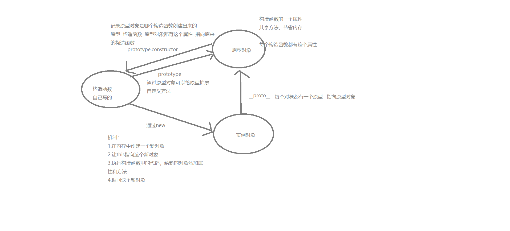

## 原型对象 prototype

> 是构造函数的属性，这个属性是一个对象，称为原型对象
>
> 每个函数都有一个prototype原型对象
>
> 作用：共享方法，达到节省内存的目的。  如果不共享方法，每次实例化对象就得创建原型链上的所有的方法，浪费内存

## 对象原型 简称原型 ____ptoto____

> **作用**：指向原型对象  只读属性  只是提供对象的查找机制
>
> 每一个对象都有一个原型，作用是指向原型对象prototype

## 构造函数 constructor

> 作用：记录是哪个构造函数创建出来的   指向构造函数本身   用来让原型对象重新指向原来的构造函数
>
> 

​	